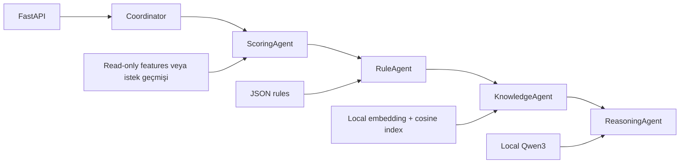

# Yerel RAG, ajanlar ve API

Bu servis deterministik anomali/kural hesabını yerel LLM açıklamasından ayırır. İşlem skoru ve inceleme kararı Python motorlarından gelir; LLM bu çıktıyı değiştiremez.



## Ajan görevleri

ScoringAgent dört katman skorunu, aggregation ve context adjustment sonucunu üretir. RuleAgent bu sonucu alıp if-then politikasını çalıştırır. KnowledgeAgent soru ve eşleşen kural ID'leri üzerinden bilgi tabanından kaynak arar. ReasoningAgent bulduğu kaynaklar ile gerçek işlem kanıtını yerel modele verir.

Coordinator görevleri tipli Task mesajlarıyla devreder. Her mesaj request_id, sender, recipient, task türü ve payload taşır. Trace, görev sırasını, girdilerin adlarını, tamamlanma durumunu ve süreyi döndürür; payload'ın tamamını loglamaz. Scoring -> rules -> retrieval -> explanation aktarımı aynı request_id ile izlenir. Bu, süreç içinde çalışan sınırlı bir uzman ajan orkestrasyonu: otonom planlama döngüsü, ayrı agent process'leri veya LLM'in skora müdahalesi yok. İlk üç uzman deterministik araçları, son uzman yerel LLM'i kullanır.

## Tasarım tercihleri

- `FeatureRepository`: hazır causal feature snapshot'ına read-only erişim; fraud etiketi yüklemez.
- `OllamaClient`: embedding/chat HTTP protokolünü uygulamadan ayıran adapter. Yalnızca loopback adresi ve yerel model adları kabul edilir; proxy ortam değişkenleri ve HTTP yönlendirmeleri kullanılmaz.
- `Container`: dependency_injector composition root. Repository, model ve istemci ThreadSafeSingleton; request coordinator ve ajanlar Factory olarak sağlanır. Testler aynı provider'ları override eder.
- `RuleEngine`: doğrulanmış koşul ağacının yorumlayıcısı; değişmez konfigürasyon kopyası ve deterministik öncelik çözümü.

Paylaşılan model/vektörler okuma amaçlıdır. Her raw-history isteği yeni FeatureBuilder oluşturur; bir isteğin verisi başka isteğin geçmişine eklenmez. Dosya değişiklikleri çalışan provider'ları kendiliğinden yenilemez; servis yeniden başlatılır. Tarihçe ingestion, eşzamanlı güncelleme ve çok süreçli state yönetimi bu prototipin kapsamı dışındadır.

## RAG

`knowledge_base/policies.json` yedi kısa belge içerir. On kural belgesi `config/rules.json` üzerinden üretilir; ayrı elle tutulan kural kopyası yoktur. Her belge tek anlamlı politika parçası olduğu için cümle ortasından kayan chunk yapılmaz. Aşırı uzun parçalar reddedilir. Ürün riski adayı davranış context deneyinden ayrı bir kaynakla anlatılır.

EmbeddingGemma query/document task prefix'leriyle 768 boyutlu embedding üretir. Unit normalization sonrası dot product cosine similarity'dir. On yedi belge için exact search hem basit hem denetlenebilir; approximate index veya bağımsız vector database servisine gerek yoktur. İlk dört kaynak, minimum 0.30 benzerlik eşiğiyle seçilir. Bu eşik bir fraud eşiği değildir; başlangıç retrieval varsayımıdır. Eşitlikte belge ID'si kullanılır.

Index, embedding model adı/digest'i ve belge hash'iyle saklanır. Belge veya JSON politika değişirse servis stale index'i reddeder. Qwen3 4B, soru + bulunan kaynaklar + varsa işlem kanıtıyla kaynak seçimi yapar. Temperature=0, seed=42, context=8192, maximum output=800 token ve thinking kapalıdır. Çıktı doğrulaması başarısızsa tek onarım denemesi yapılır. Kaynak seçim alanı, bulunan kaynak ID'lerinden türetilen enum ile sınırlanır. Bunlar farklı runtime/GPU sürümlerinde birebir aynı seçim garantisi değildir. Model adı yanında gerçek digest raporlanır.

Serbest metinde yalnız citation kontrolü yetmiyor: kaynak ID'si listede olsa da metin motorun kararıyla çelişebilir, doğrulayıcının bakabileceği tek şey ID. Bu yüzden model sözleşmesi `source_ids`, `language` ve `abstained` alanlarıyla sınırlı. Model soru, kaynaklar ve işlem kanıtı üzerinden en fazla üç ilgili kaynak seçer; başka alan ve serbest metin kabul edilmez. Kaynak ID'si uydurulursa/tekrarlanırsa veya abstention ile seçim çelişirse tek onarım denenir; ikinci başarısızlıkta 502 döner.

API `answer`, `citations`, `limitations`, `abstained` alanlarını korur. Ek olarak `answer_mode=source_selection_with_engine_facts`, `source_quotes` ve `authoritative_evidence` döner. `explanations.py` kararı, kazanan kuralı, koşul/eşik/gözlemleri ve skorları doğrudan motor kanıtından yazar; LLM bu alanları oluşturmaz. Seçilen kaynaklar nitelemeleri korunacak şekilde tam alıntılanır; kaynak dili değiştirilmez. Genel politika metni ile mevcut işlem kararı açıkça ayrılır. Kaynak yoksa model çağrılmaz; kaynak yanıtı abstain eder, mevcut işlem kanıtı yine gösterilir.

Bu kısıtlı RAG tasarımının bedeli serbest dil sentezinden vazgeçmek. LLM bağlam üzerinden ilgili kaynağı seçiyor; kaynağın doğruluğu ve seçimin soruyla ilgisi hâlâ değerlendirme gerektirir. Eski hatalı serbest metin, karar ve skor enjeksiyonu, tam kaynak metni, eksik kaynak ve priority açıklaması regression testleriyle kontrol edilir. RAG smoke soruları geliştirme setidir.

İşleme özel açıklamada, retrieval'ın getirdiği kural belgeleri gerçek eşleşme listesiyle süzülür; eşleşmeyen kural LLM'e açıklama kaynağı olarak verilmez. Genel politika notları korunur. Bu süzme top-k seçiminden **sonra** yapılıyor ve liste yeniden doldurulmuyor: eşleşen kural belgesi cosine sıralamasında top-k'nin altında kaldıysa açıklamaya hiç ulaşmaz. Süzme sonucu hiç kaynak kalmazsa model çağrılmadan abstain edilir ve gerekçe olarak filtrelemenin kendisi bildirilir, benzerlik eşiği değil. Bunu bilinçli bırakıyorum: yeniden doldurmak, alakasız belgeyi kaynak olarak göstermekten daha iyi değil. Doğru çözüm k'yı büyütüp süzmek olurdu; onu ölçmedim. `/rag/query` işlem kanıtı taşımadığından tüm kural belgelerini sorgulayabilir. Eşleşmeyen bir kuralın koşul analizi, `/rules/evaluate` içindeki tam trace üzerinden incelenir.

## İstek sözleşmesi

`FRAUD_CONTEXT_PROFILE` servis başlatılırken `raw` (varsayılan), `behavior_context` veya `product_risk` seçer. Container servis örneğini bu profille oluşturur; profil istek gövdesinden değiştirilemez. `/health` ve skor yanıtları aktif profili içerir. Üç profil aynı dört anomali katmanı, ağırlıklar ve JSON iş kurallarını kullanır.

`raw` hiçbir context indirimi uygulamaz: `adjusted_anomaly_score` ham skora eşit, `context_reduction` sıfırdır. Bunu varsayılan yaptım çünkü davranış context'i sabit inceleme bütçesinde ek fraud yakalamadı ([context raporu](../reports/context_adjustment.md)). Kural eşleşmeleri yine raporlanır; kapalı olan yalnızca skora etkisi, açıklamanın kendisi değil. `behavior_context` aynı motoru `artifacts/context/selected_config.json` içindeki seçilmiş güçle çalıştırır ve `data/processed/context_scores.parquet` ile aynı sayıları üretir.

`product_risk`, `artifacts/product_context/policy.json` dosyasını gerektirir. Case'in işlem tipi risk bağlamını train etiketleriyle öğrenir; bu katman gözetimlidir. Eğitim kesiminden eski/eşit zamanlı isteklerde, bilinmeyen veya az destekli üründe ek risk düzeltmesi yoktur. Negatif düzeltmeler güçlü anomali guard'larıyla bloke edilir. Takvim/güven kuralları korunur. Ürün riski katkısı ayrı bir terimdir: davranış context katman katkıları toplamı + `product_context_adjustment` = final adjusted skor. `context_reduction` yalnızca davranış indirimidir; toplam değişim `context_net_adjustment` alanındadır. Açıklama kaynaklı profil sayımları, zaman kesimi, guard ve uygulanan miktarı gösterir. Skor fraud olasılığı değildir.

[Geliştirme raporu](../reports/product_context.md) %5 inceleme kapasitesinde kazanım ve %1'de kayıp gösterir. Otomatik olarak her bütçeye uygun kabul edilmez. R09'un sabit eşiği değişmediği için [kural yükü](../reports/product_profile_verification.md) ayrıca raporlanır.

Kayıtlı işlem:

`/explain` için özel soru verilmezse kazanan kural ve karar üzerinden İngilizce bir soru oluşturulur. İsteğe bağlı `question` alanıyla Türkçe veya İngilizce soru gönderilebilir; küçük yerel modelin dil kalitesi ve yanıt tutarlılığı sınırlıdır. Şema kontrolü bu kaliteyi garanti etmez.

```json
{"transaction_id": 3400481}
```

Yeni işlem ve açık geçmiş:

```json
{
  "transaction": {
    "TransactionID": 900002,
    "TransactionDT": 3600.0,
    "TransactionAmt": 250.0,
    "card1": 1.0, "card2": 2.0, "card3": 3.0,
    "card5": 5.0, "addr1": 6.0,
    "card4": "visa", "ProductCD": "W", "has_identity": false
  },
  "history": [{
    "TransactionID": 900001,
    "TransactionDT": 0.0,
    "TransactionAmt": 100.0,
    "card1": 1.0, "card2": 2.0, "card3": 3.0,
    "card5": 5.0, "addr1": 6.0,
    "card4": "visa", "ProductCD": "W", "has_identity": false
  }]
}
```

History en fazla 1000 işlem içerir. ID'ler tekil, tüm geçmiş zamanları hedeften kesinlikle erken olmalıdır. Geçmiş kendi içinde kronolojik sıralanır; aynı saniye grubunun atomic davranışı korunur. Feature geçmişi ve global kategori frekansları yalnızca gönderilen örneği kapsar; eksik bir geçmiş tam üretim geçmişiymiş gibi sunulmaz. Beşten az geçmişle entity/temporal katmanlar null kalır.

Gerçek takvim referansı istenirse offset içeren ISO `calendar_reference` ayrıca verilir; referansın doğruluğu çağırana aittir. Kayıtlı ID modunda geçmiş veya takvim değiştirme kabul edilmez.

`/score`, `/explain` ve `/rules/evaluate` istekleri isteğe bağlı `external_context` kabul eder. Aşağıdaki nesne kayıtlı ID veya açık işlem isteğine eklenebilir:

```json
{
  "external_context": {
    "trusted_entity": true,
    "trust_observed_at": 100.0,
    "trust_source": "synthetic-demo-review",
    "weekend_activity_expected": true,
    "schedule_observed_at": 100.0,
    "schedule_source": "synthetic-demo-schedule"
  }
}
```

Bu örnek kaynaklar sentetiktir. Zamanlar `TransactionDT` ile aynı göreli saniye eksenindedir. True bayrak için boş olmayan kaynak ve sonlu, negatif olmayan gözlem zamanı zorunludur; aynı saniye/gelecek kayıtları indirim sağlamaz. Bağlam sunucu tarafından istekteki işlem ID'sine bağlanır, başka bir ID verilemez ve sonraki isteğe taşınmaz. Kaynak kimliği bağımsız doğrulanmaz; bu yerel prototipte çağıranın beyanıdır. Takvim yoksa hafta sonu programı tek başına weekend indirimi sağlamaz. Güçlü anomali korumaları geçerli güven kaydında da uygulanır. [Altı API senaryosu](../reports/context_api.md) gerçek kayıtlı modelle çalıştırılmıştır; gerçek veri üzerindeki fraud başarısı olarak sunulmaz.

Pydantic bilinmeyen alanları, ID için string/bool değerlerini ve sonlu olmayan sayıları reddeder. JSON null katman yokluğunu belirtir; NaN/Infinity yanıt gönderilmez.

| Durum | HTTP |
|---|---:|
| Geçersiz istek, gelecekteki geçmiş veya eksik feature sözleşmesi | 422 |
| Kayıtlı TransactionID bulunamadı | 404 |
| Model/artifact eksik veya yerel Ollama erişilemiyor | 503 |
| İki denemede de doğrulanamayan LLM açıklaması | 502 |

## Offline çalışma ve yeniden üretim

Yerel modelin soğuk yüklemesi bu Windows ortamında üç dakikalık istemci süresini aştı. `config/rag.json` model çağrısı için 600 saniyelik üst sınır kullanır; HTTP kontrolü buna 660 saniye ayırır. Bu bir üst bekleme sınırı, hedeflenen yanıt süresi değil. Demodan önce bir model çağrısı yapıp ilk yüklemeyi geçirmekte fayda var. Model bellekte yalnız kısa süre tutulur; kaynak kullanımı için sürekli yüklü bırakılmaz.

İlk kurulum Python paketleri, Kaggle verisi, Ollama ve model indirmeleri için internet ister. Sonraki scoring, embedding, retrieval ve generation yerelde çalışır. Ollama yalnızca loopback adresinde, cloud kapalı başlatılır. Setup betiği model dosyalarını ve sürüm/digest bilgilerini proje içinde saklar. Fiziksel ağ kesme testi yapılmadı; uygulama protokolü loopback ile sınırlandırıldı.

`requirements.lock` bu Windows/Python ortamındaki dependency closure'ı sabitler. Model binary'leri ve Kaggle verisi pakete konmaz; kurulum ve feature/model/index üretim komutları README'dedir. Yerel `joblib` yalnızca bu projenin güvenilir hazırlık komutlarıyla üretilmiş model dosyasını yüklemelidir.

İşlem değerlendirmesi, RAG smoke seti ve API testleri farklı kanıtlardır. Testlerin geçmesi fraud başarısının arttığı anlamına gelmez. Final sayısal değerlendirme [ayrı raporda](../reports/final_evaluation.md); RAG yanıtları [yerel model raporundadır](../reports/local_rag.md).

## Kaynaklar

- [Ollama Windows portable kurulumu](https://docs.ollama.com/windows)
- [Ollama local-only ayarı](https://docs.ollama.com/faq)
- [Ollama embedding API](https://docs.ollama.com/api/embed), [chat API](https://docs.ollama.com/api/chat)
- [EmbeddingGemma model kartı ve retrieval prefix'leri](https://huggingface.co/google/embeddinggemma-300m)
- [Qwen3 4B model paketi](https://ollama.com/library/qwen3:4b)
- [Dependency Injector provider yaşam döngüsü](https://python-dependency-injector.ets-labs.org/providers/singleton.html)
- [FastAPI dependency testleri](https://fastapi.tiangolo.com/advanced/testing-dependencies/)
