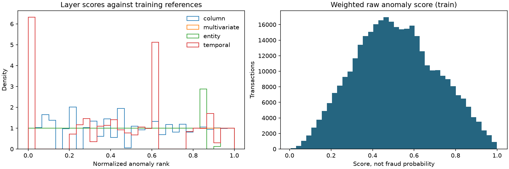

# Çok katmanlı anomali skorlama

## Yöntem

Model ve normalizasyon referansları yalnızca train feature'larından fit edildi. Hedef etiketler bu komutta okunmadı. Aşağıdaki skorlar fraud olasılığı veya performans sonucu değildir.

| Katman | Hesap |
|---|---|
| Column | log(1+tutar) değerinin train medyanından mutlak uzaklığı / robust ölçek |
| Multivariate | 21 açık feature, train medyanıyla imputation + missing indicator, IsolationForest negatif score_samples |
| Entity | max(tutar sapması, 2 × gözlenen ilişki yeniliği); en az 5 geçmiş işlem |
| Temporal | 1/24 saat velocity ve entity saat-fazı nadirliği için train referansına göre pozitif sapmaların maksimumu; en az 5 geçmiş işlem |

Entity tutar sapmasının paydası max(geçmiş std, geçmiş ortalamanın %10'u, 1 tutar birimi). Bu taban, çok küçük/sıfır varyansın skoru patlatmasını sınırlar. İlişki yeniliği çarpanı 2 açıklanmış başlangıç sezgisidir; optimize edildiği iddia edilmez.

Robust ölçek IQR/1.349'dur; dağılım yoğunlaşmışsa (p90-p10)/2.563, o da sıfırsa 1 kullanılır. Kesikli dağılımlarda bu fallback ayrıca model metadata'sında saklanır.

IsolationForest: 128 ağaç, ağaç başına en fazla 1024 train örneği, seed=42, tek CPU işçisi. ID, hedef, split, ham elapsed time ve tüm-stream sayacı modele girmez. Eksik calendar alanları da allowlist'te değildir.

## Normalizasyon ve birleştirme

Her katman kendi train skorlarının sıralı referansına göre normalize edilir: count(train_raw < current_raw) / N. Bu strict rank yöntemi sayesinde aynı sıfır skoruna sahip kalabalık bir grup yüksek anomali yüzdeliği almaz. Train maksimumundan büyük skor 1 olur; eksik skor eksik kalır.

Başlangıç ağırlıkları dört katmanda eşittir (%25). Henüz bir katmanın daha iyi fraud tespiti yaptığına dair ölçüm olmadığı için eşit ağırlık seçildi. Yapılandırma `config/scoring.json` dosyasındadır. Ağırlık/threshold seçimi yapılacaksa yalnızca validation kullanılmalıdır.

Eksik katmanlar risksiz sayılmaz. Mevcut katman ağırlıkları kendi toplamlarına bölünür. Örneğin yalnızca column ve multivariate varsa etkin ağırlıkları %50/%50, available_weight=0.5 olur. Final katkılar toplamı raw_anomaly_score'a eşittir. Farklı coverage seviyelerinde eşik davranışı değerlendirme aşamasında ayrıca ölçülmelidir.

## Kapsama

| Bölüm | İşlem | Column | Multivariate | Entity | Temporal |
|---|---:|---:|---:|---:|---:|
| train | 354,324 | %100.00 | %100.00 | %63.67 | %63.67 |
| validation | 118,108 | %100.00 | %100.00 | %75.96 | %75.96 |
| test | 118,108 | %100.00 | %100.00 | %79.38 | %79.38 |

## Açıklanabilirlik

Her işlem için katman raw/normalized skorları, availability, etkin ağırlıklar ve katkılar kaydedilir. Entity/temporal alt bileşenleri ayrıca korunur. `AnomalyEngine.explain` gözlenen özellikleri, eşikleri ve referansları döndürür. IsolationForest için henüz feature attribution uygulanmadı; model skorunu gerekçelendiren uydurma bir SHAP açıklaması üretilmez.

## Sınırlar ve sonraki kontrol

Anomali ile fraud farklı hedeflerdir. Bu rapor ham anomali skorlarını kapsar; context etkisinin validation değerlendirmesi [context raporundadır](context_adjustment.md). Train skor dağılımı in-sample'dır ve başarı ölçüsü değildir. Feature geçmişi validation/test sırasında kronolojik ve etiketsiz güncellenir; model ve skor referansları sabit kalır.

Yerel çıktı: `data/processed/scores.parquet`. Model: `artifacts/scoring/model.joblib`. Metadata ve açıklama örneği aynı klasördedir. Joblib yalnızca bu projede üretilmiş güvenilir yerel model dosyaları için kullanılmalıdır.

Kaynak: [scikit-learn IsolationForest](https://scikit-learn.org/stable/modules/generated/sklearn.ensemble.IsolationForest.html).
