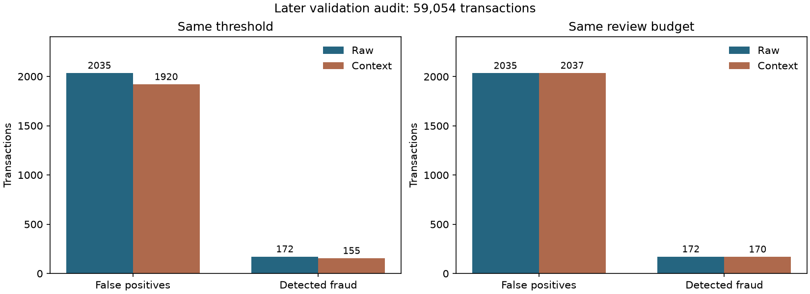

# Context Adjust Engine

## Deney tasarımı

Context, anomali katmanlarının ayrı katkılarını gerekçeli ve sınırlı şekilde azaltır. Bilinen yeni ilişki, güçlü multivariate/entity sapması veya yüksek saatlik velocity varsa indirim bloke edilir. Aynı katmana uyan kuralların en büyük indirimi alınır; eşitlikte dosyadaki sıra korunur. Toplam indirim en fazla 0.05 puan ve raw skorun %15'idir.

Bu kurallar operasyonel hipotezlerdir; gerçek şirket politikası olarak sunulmaz. İndirim gücü adayları (0, 0.25, 0.5, 1) calibration değerlendirmesinden önce tanımlandı. Validation'ın ilk yarısında, recall kaybı en fazla 1 yüzde puan olmak üzere en çok false positive azaltan güç seçildi. Eşitlikte daha az recall kaybı, sonra daha küçük güç tercih edilir. Sonraki validation yarısı güç seçiminde kullanılmadı. İlk no-op denemesinde bu yarının toplam baseline metrikleri görülmüş olduğundan sonuç bir geliştirme kontrolüdür; hiç görülmemiş final holdout olarak sunulmaz. Final test etiketleri okunmadı.

- Calibration: 59,054 satır; audit: 59,054 satır.
- Aynı saniye gruplarını ayırmayan sınır: 10438003.
- Eşik: 0.85167813. Train raw skorlarının üst yaklaşık %5'i için seçildi; iş kapasitesi verilmediğinden %5 deney varsayımıdır.
- Calibration'da seçilen indirim gücü: 0.5.

## Context kuralları

| Kural | Etkilenen katman | Koşul | Azaltım |
|---|---|---|---|
| İşlem türü için alışıldık tutar | Column | Global tutar rank >=0.90; kendi ProductCD grubunun train p10–p90 aralığında; en az 1000 train gözlemi; guard yok | Katman katkısının %10'u × seçilen güç |
| Sık ve alışıldık faaliyet | Temporal | En az 20 geçmiş işlem, 7 gün, alışıldık tutar/ilişkiler ve desteklenen saat fazı | Katman katkısının %20'si × seçilen güç |
| Entity için alışıldık yüksek tutar | Column | Yukarıdaki yerleşik davranış ve global tutar yüzdeliği >=0.90 | %15 × güç |
| İş saatleri | Temporal | Açık takvim, hafta içi 09–17 ve istikrarlı entity davranışı | %10 × güç |
| Beklenen hafta sonu faaliyeti | Temporal | Açık takvim, hafta sonu, işlemden önceki dış çalışma takvimi ve istikrarlı davranış | %10 × güç |
| Doğrulanmış güven | Multivariate | İşlemden önceki kaynaklı güven kaydı ve istikrarlı davranış | %10 × güç |

İstikrarlı davranışta amount/prior_mean 0.8–1.25 aralığında, entity_raw <=1 ve ürün ilişkisi bilinen olmalıdır. Bilinen yeni ürün/e-posta alanı/cihaz açıklaması indirimi bloke eder. Bilinmeyen e-posta/cihaz geçmişi güven kanıtı sayılmaz; kararın mevcut ürün/tutar geçmişine dayandığı kabul edilir.

## Aynı eşikte: validation audit

| Ölçüm | Raw | Context sonrası |
|---|---:|---:|
| Alarm | 2,207 | 2,075 |
| Yakalanan fraud (TP) | 172 | 155 |
| Yanlış alarm (FP) | 2,035 | 1,920 |
| Kaçırılan fraud (FN) | 1,889 | 1,906 |
| Doğru normal (TN) | 54,958 | 55,073 |
| Precision | %7.793 | %7.470 |
| Recall | %8.345 | %7.521 |
| False positive rate | %3.571 | %3.369 |
| Average Precision (AP) | %6.340 | %6.340 |

Aynı işlemler üzerinde 115 yanlış alarm kaldırıldı; 17 fraud alarmı da kaldırıldı. Recall farkı 0.825 yüzde puan kayıptır. FP sayısı azalması ile FPR azalması farklı ölçümlerdir; FPR paydası gerçek normal işlem sayısıdır.

Bu revizyonun sayısal audit ölçütü (FP azalması ve recall kaybı <=1 yüzde puan): **geçti**. Güç seçimi sonrası audit sonucuna göre parametre değiştirilmedi. Recall toleransı deney varsayımıdır; şirketin kabul ettiği kayıp bütçesi değildir. Bu tek zamansal kesitteki sonuç, üretim etkisi veya istatistiksel anlamlılık garantisi değildir.

FP sayısındaki göreli azalma %5.651; baseline'ın yakaladığı fraud sayısındaki göreli kayıp %9.884. Küçük bir mutlak recall farkı, yakalanan fraud'ların kayda değer bölümünü kaybetmek anlamına gelebilir.

### Kararın dönüm noktası

Maliyet verisi elimde yok, ama kararı verilebilir hale getiren orana ihtiyacım da yok: 115 yanlış alarm kaldırdım ve 17 fraud kaybettim. Tek bir başa baş sayısı vermek yetersiz olurdu, çünkü sayı kayıp fonksiyonunu nasıl kurduğunuza bağlı. Üç açık model:

| Maliyet modeli | Varsayım | Context kazandıran koşul |
|---|---|---|
| Sadece yanlış alarm maliyetli | Doğru alarmın incelemesi bedava | kaçırılan fraud / yanlış alarm < **6.76** |
| Her inceleme maliyetli | Sonucu ne olursa olsun her inceleme aynı maliyet | kaçırılan fraud / inceleme < **7.76** |
| Yakalananın yalnızca %50'i önlenebiliyor | Kalanı zaten kaybedilecekti | kaçırılan fraud / yanlış alarm < **13.53** |

Bu koşulların sağlanmasını beklemiyorum, ama bu bir ölçüm değil beklenti: bana maliyet verisi verilmedi, dolayısıyla oranın gerçekte nerede olduğunu bu çalışmadan bilmiyorum. Beklentimin dayanağı şu gerekçe: bir yanlış alarmın maliyeti birkaç dakikalık inceleme, kaçırılan fraud'un maliyeti işlem tutarı artı geri ödeme. Gerekçeyi bulgu gibi sunmuyorum; şirket kendi iki maliyetini yukarıdaki eşiklere koyup kararı kendisi verir.

Modellemediğim şeyler: işlem tutarı (kaybedilen fraud'u bir birim sayıyorum, tutarını değil), inceleme kapasitesinin kuyruk etkisi, yanlış alarmın müşteri tarafındaki maliyeti. Bu üçü olmadan kesin bir ekonomik sonuç yazmam doğru olmazdı.

### Seçim ölçütündeki eksik

Yukarıdaki güç seçimini kuran ölçüt şuydu: sabit eşikte false positive azalt, recall kaybını 1 yüzde puanla sınırla. Hedef tarafı case'in istediği şeydi, azaltılacak olan false positive. Eksik olan kısıt tarafı: kaybı mutlak puanla sınırlamak, baseline recall %8 civarındayken yakalanan fraud'un onda birini kaybetmeye izin veriyor. Birincil ölçüt sabit inceleme kapasitesinde yakalanan fraud olmalıydı; kapasite sabitken TP farkı kaybı da kazancı da aynı sayıda ölçtüğü için ayrı bir kayıp toleransına gerek kalmıyor. Aynı calibration yarısında o kurulumla yeniden seçim koştum: seçim **0**, yani context hiç devreye girmezdi ([ölçüt karşılaştırması](context_criterion.md)). Sıfırdan farklı her güç eşit kapasitede daha az fraud yakalıyor. Yani context'in devreye girmesinin nedeni verideki bir kazanım değil, ölçütün eksik kurulmasıydı. Aynı kapasite karşılaştırmasını seçimden sonra değil önce yapmam gerekirdi.

Bu sonucu servise de yazdım. Servisin varsayılan context profili `raw`: indirim uygulanmaz, `adjusted_anomaly_score` raw skora eşit çıkar. Buradaki davranış `behavior_context` profiliyle açıkça istenirse çalışır, `product_risk` ayrı bir geliştirme adayıdır. Eşleşen kural listesi üç profilde de raporlanır; kapattığım şey kuralın görünürlüğü değil skora etkisi. Varsayılanın gerçekten indirim uygulamadığını `scripts/verify_context_api.py` altı senaryoda ve 64 kayıtlı işlemde ölçer, `tests/test_api.py` de aynı sözleşmeyi test eder. Aksi halde bu bölüm 'açmamak gerekir' derken kod açık bırakmış olurdu.

## Aynı inceleme kapasitesi

İki yöntem de audit üzerinde tam 2,207 işlemi incelemeye gönderirse (skor eşitliğinde TransactionID sırası):

| Ölçüm | Raw | Context sonrası |
|---|---:|---:|
| Yakalanan fraud | 172 | 170 |
| Yanlış alarm | 2,035 | 2,037 |

Bu karşılaştırma, yalnızca daha az alarm üretmekten doğan görünür iyileşmeyi sıralama değişiminden ayırır. Average Precision bütün sıralamayı değerlendirir; bir eşikte FP azaltmak AP'nin de yükseldiği anlamına gelmez.

Sabit bütçede yakalanan fraud artışı: **yok**. Dolayısıyla bu çalıştırmanın context indirimi genel bir model iyileşmesi olarak sunulmaz. Alarm maliyeti ve kaçırılan fraud maliyeti verilmeden işletme açısından tercih kararı çıkarılamaz.

## Tek kural etkileri (audit, aynı eşik)

| Tek aktif kural | Eşleşen işlem | Kaldırılan FP | Kaybedilen TP |
|---|---:|---:|---:|
| product_typical_amount | 595 | 115 | 17 |
| frequent_familiar_activity | 5,015 | 0 | 0 |
| familiar_high_amount | 94 | 0 | 0 |
| business_hours | 0 | 0 | 0 |
| expected_weekend | 0 | 0 | 0 |
| verified_trust | 0 | 0 | 0 |

Tek kural etkileri üst üste toplanamaz; aynı işlem birden fazla koşula uyabilir ve ortak cap vardır.

## İşlem türü bağlamı

ProductCD kodlarının gerçek iş anlamı bilinmez. Her ürün kodunda en az 1000 train gözlemiyle öğrenilen p10–p90 tutar aralığı kullanılır. Eşleşmeyen veya desteklenmeyen yeni ürün koduna indirim verilmez. Bu kural tutar sinyalinin yalnızca ilgili katkısını azaltır; diğer katmanlar korunur. Referans aralıkları train dışındaki kayıtlarla güncellenmez. İlk entity-only denemesi eşik üzerinde hiç FP azaltmadı; ürün bağlamı bu tespit sonrası, calibration feature'ları üzerinde geliştirildi.

## Eksik dış bağlam

IEEE-CIS başlangıç takvimi, gerçek müşteri güven listesi ve çalışma takvimi sağlamaz. Bu çalıştırmada business-hours, weekend ve trust dalları veri uydurularak etkinleştirilmedi. Üç dal sentetik senaryo testlerinde doğrulandı; gerçek FP etkileri burada ölçülemedi. Sık entity, trusted entity olarak etiketlenmedi.

Dış bağlam TransactionID ile eşlenir. Trusted flag için trust_source ve trust_observed_at; hafta sonu planı için schedule_source ve schedule_observed_at gerekir. Zamanlar TransactionDT ile aynı saniye referansında olmalıdır. Kaynak eksikse hata; kayıt işlemden sonra veya aynı saniyede gözlenmişse indirim yoktur. Alanların doğruluğu sağlayan sisteme aittir; bu prototip kaynağı harici bir kurumdan doğrulamaz.

## Çıktılar

- `data/processed/context_scores.parquet`: orijinal skorlar, kural eşleşmeleri, katman indirimleri, nedenler ve adjusted_anomaly_score.
- `artifacts/context/evaluation.json`: calibration araması, audit, sabit bütçe, eşik duyarlılığı, kapsama grupları ve girdi SHA-256 değerleri.
- `artifacts/context/selected_config.json`: yalnızca calibration'da seçilen sabit yapılandırma.
- `artifacts/context/explanation.json`: audit içindeki bir işlemin gerçek indirim açıklaması.

