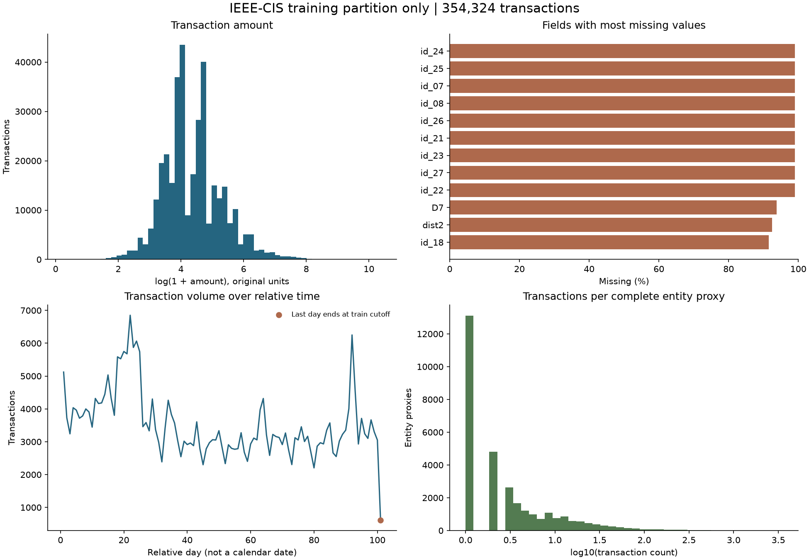

# Veri hazırlama ve profil analizi

Kaynak: [IEEE-CIS Fraud Detection](https://www.kaggle.com/competitions/ieee-fraud-detection/data).

## Kapsam

Birleştirme ve temel kalite kontrolleri tüm eğitim dosyalarını kapsar. Dağılımlar, korelasyonlar, nadir kombinasyonlar ve entity örüntüleri yalnızca zaman sırasındaki ilk %60 üzerinde hesaplanır. Sonraki %20 validation, son %20 test için ayrılır. Eşit zaman damgaları farklı bölümlere dağıtılmaz.

Bu rapor betikle üretilir. Veri kalite kontrolleri dağılımı değiştirmez; doldurma, outlier silme veya model eğitimi yapılmaz.

## Birleştirme ve kalite

- Transaction: 590,540 satır; identity: 144,233 satır.
- Left join sonucu: 590,540 satır, 435 kolon (`has_identity` dahil).
- Identity eşleşmesi: %24.42; eşleşmeyen işlem: 446,307.
- Tüm dosyadaki fraud oranı: %3.50 (20,663 işlem).
- Tekrarlı/eksik anahtar, orphan identity, negatif veya sonlu olmayan zaman/tutar ve geçersiz etiket kontrolleri geçti.
- Sıfır tutarlı işlem: 0. Bu değer eksik tutarla aynı kabul edilmez.

## Zaman ayrımı

| Bölüm | Satır | İlk saniye | Son saniye |
|---|---:|---:|---:|
| train | 354,324 | 86400 | 8745772 |
| validation | 118,108 | 8745798 | 12192842 |
| test | 118,108 | 12192900 | 15811131 |

`TransactionDT` açıklanmayan bir referansa göre geçen saniyedir. Saat, haftanın günü ve hafta sonu için gerçek takvim varsayımı burada yapılmaz. `elapsed_time` rolü, gerçek `datetime` rolünden ayrıdır.

## Kolon tipleri ve eksiklik

Fiziksel dtype ile semantik rol ayrılır. Örneğin `card1` sayısal saklanan bir kategoridir; büyüklüğü kartlar arasında anlamlı mesafe oluşturmaz. ID ve hedef ayrı roller alır. Tanınmayan numeric kolonlara isimlerinden iş anlamı yüklenmez.

Train profilinde 354,324 satır ve 435 kolon var. Rol dağılımı: numeric: 382, categorical: 50, identifier: 1, target: 1, elapsed_time: 1.

| Kolon | Eksik oranı |
|---|---:|
| id_24 | %99.08 |
| id_25 | %99.01 |
| id_07 | %99.00 |
| id_08 | %99.00 |
| id_26 | %99.00 |
| id_21 | %99.00 |
| id_27 | %99.00 |
| id_23 | %99.00 |
| id_22 | %99.00 |
| D7 | %93.77 |

Eksik değerler bu aşamada korunur. Identity tablosunun bulunmaması ile bulunan identity kaydındaki boş bir alan, `has_identity` sayesinde ayrıştırılabilir.

## Yüksek cardinality

Kategorik alanlarda en az 100 farklı değer veya en az 20 farklı değerle birlikte %5 benzersizlik oranı kullanılır. Bu bir inceleme eşiğidir; kolon silme kararı değildir.

| Kolon | Farklı değer |
|---|---:|
| card1 | 11,735 |
| DeviceInfo | 1,446 |
| card2 | 499 |
| id_19 | 492 |
| id_21 | 397 |
| id_20 | 343 |
| addr1 | 308 |
| id_25 | 291 |
| id_33 | 163 |
| card5 | 108 |
| card3 | 102 |
| id_31 | 101 |
| id_17 | 100 |

## Dağılım ve outlier

Her numeric alan için min, p01, p25, medyan, p75, p99, max, ortalama, standart sapma ve IQR kaydedilir. IQR sınırı dışındaki bir değer otomatik olarak fraud sayılmaz. IQR=0 olan ayrık dağılımlar ayrıca işaretlenir.

Zaman grafiğindeki son gün train sınırında kesilir. O noktadaki düşük hacim tam günlük bir düşüş olarak yorumlanmamalıdır.

## Nadir kombinasyonlar

Birlikte gözlenen kategorilerde destek sayısı en fazla 5 olan kombinasyonlar raporlanır. Eksik bileşenler bu hesaptan çıkarılır; sayıları ayrıca verilir. Bu betimleyici özetler gelecekteki işlemler için doğrudan feature değildir.

- `ProductCD + card4`: 18 farklı kombinasyon; 1 nadir kombinasyon, 2 satır. Eksik bileşen nedeniyle dışarıda kalan: 827.
- `P_emaildomain + R_emaildomain`: 590 farklı kombinasyon; 340 nadir kombinasyon, 676 satır. Eksik bileşen nedeniyle dışarıda kalan: 269,703.
- `DeviceType + id_31`: 113 farklı kombinasyon; 19 nadir kombinasyon, 35 satır. Eksik bileşen nedeniyle dışarıda kalan: 259,424.

## Kolon ilişkileri

Train içinden sabit tohumla seçilen 30,000 satırda Spearman korelasyonu kullanılır. Her çift için en az 100 ortak dolu gözlem gerekir. Hedef, kimlik ve kategori kodları dahil edilmez. Korelasyon neden-sonuç ilişkisi kurmaz.

| Alan 1 | Alan 2 | Spearman | Ortak gözlem |
|---|---|---:|---:|
| D4 | D12 | 1.000 | 3,219 |
| V1 | V88 | 1.000 | 12,421 |
| V14 | V41 | 1.000 | 20,211 |
| V14 | V65 | 1.000 | 24,689 |
| V27 | V28 | 1.000 | 25,034 |
| V27 | V68 | 1.000 | 24,689 |
| V27 | V89 | 1.000 | 24,174 |
| V28 | V68 | 1.000 | 24,689 |
| V28 | V89 | 1.000 | 24,174 |
| V41 | V65 | 1.000 | 20,248 |

## Entity davranışları

Vekil anahtar: `card1 + card2 + card3 + card5 + addr1`. Gerçek kullanıcı kimliği değildir; çakışma ve aynı kişinin farklı anahtarlara dağılması mümkündür. Bileşenleri eksik işlemler tek bir 'unknown user' grubunda birleştirilmez.

- Tam anahtarlı işlem: 308,416; eksik anahtarlı işlem: 45,908.
- Entity vekili sayısı: 31,324; yalnızca bir işlemli: 13,106.
- Entity başına medyan işlem sayısı: 2.
- Ardışık işlemler arasındaki medyan süre: 39983.0 saniye.

Entity başına işlem sayısı, ortalama/std tutar, faaliyet süresi, ürün ve e-posta alanı çeşitliliği hesaplanır. Bunlar train döneminin betimleyici özetleridir. Model feature'larında her işlem için yalnızca önceki kayıtlar kullanılacaktır.

## Üretilen dosyalar

- `artifacts/profile/summary.json`: kalite, split, nadir kombinasyon, ilişki ve entity özetleri.
- `artifacts/profile/columns.json`: tüm kolonların tip, eksik değer, cardinality ve dağılım profili.
- `artifacts/profile/categories.json`: kategori frekansları ve eksik sayıları.
- `data/processed/transactions.parquet`: satır kaybetmeden birleştirilmiş veri ve split etiketi.
- `data/processed/entity_profile.parquet`: yalnızca train entity özetleri; model girdisi olarak kullanılamaz.

Dosya parmak izleri `data/raw/manifest.json` içindedir. Ham veri ve satır bazlı türevler Git kapsamı dışındadır.
